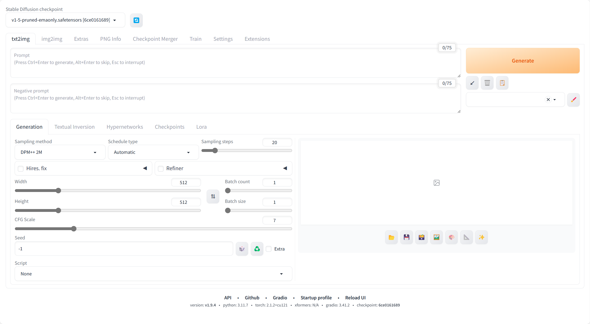
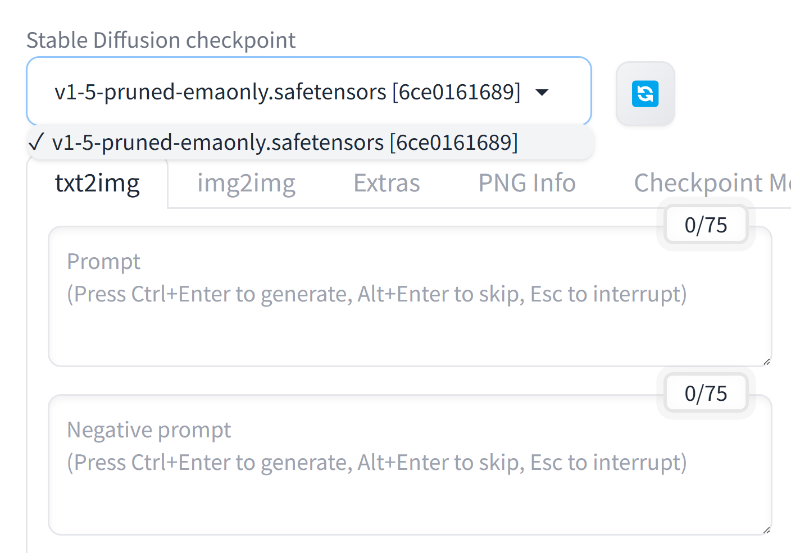
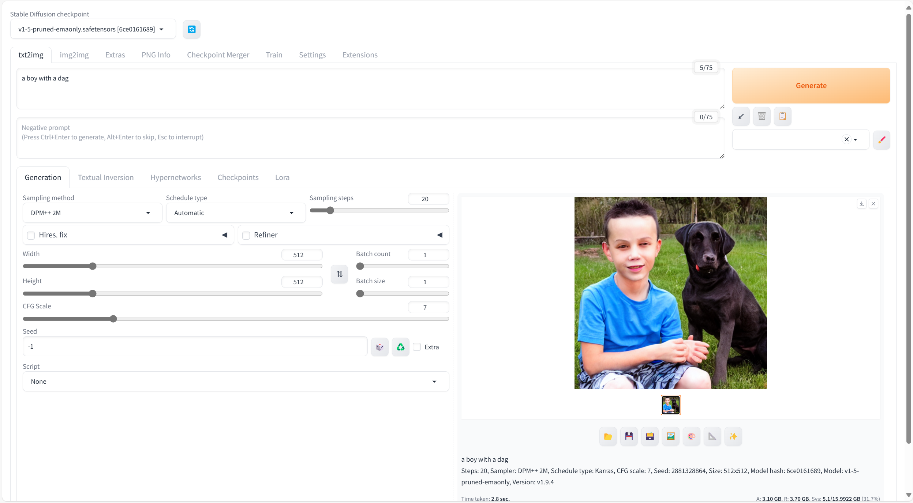
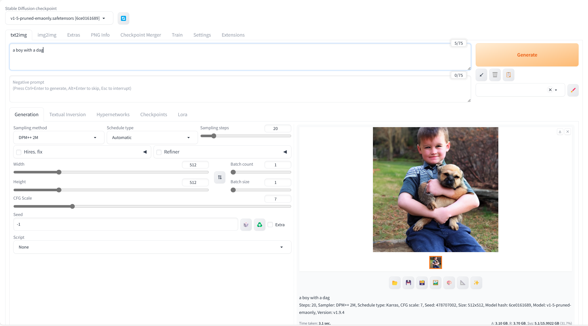
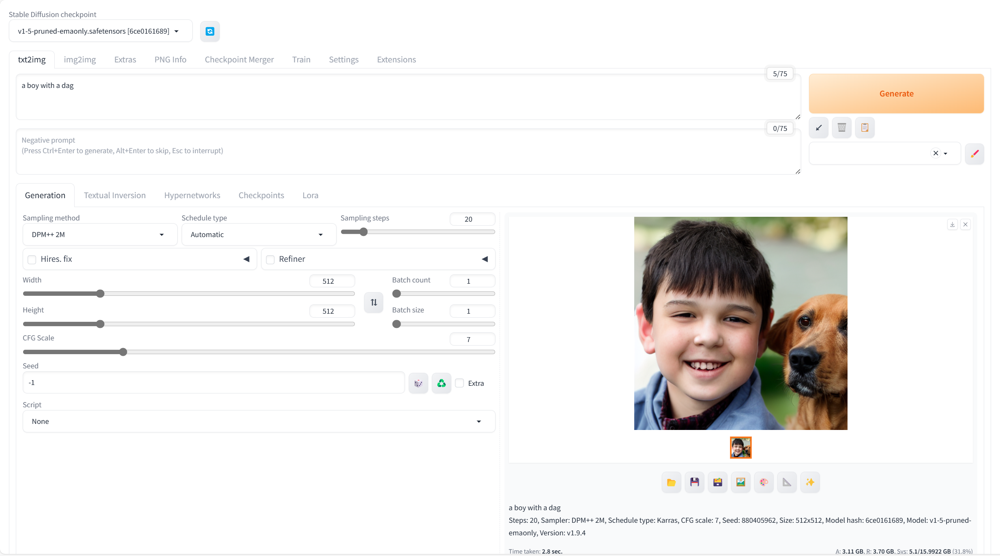
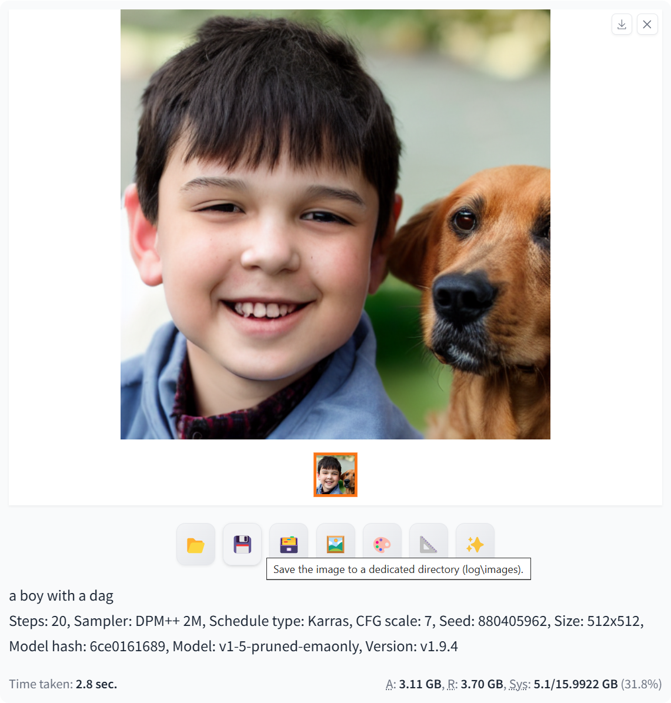

# SD3-跑通一个小例子

## 通过命令：.\webui-user.bat 运行

## .\web-user.bat 启动

## 查看使用的模型

## code: a boy with a dog

## 重新输入命令：a boy with a dog

## 重新输入命令：a boy with a dog

1. 可见，每次输入相同的命令，但是输出的图片内容大概率不相同。
2. v1-5-pruned-emaonly.safetensors [6ce0161689] 模型在输出内容的时候，仍然会出现一些对象绘制不准确的情况。

## 保存生成的图片

通过点击生成图片下方的保存按钮，对图片进行保存。

