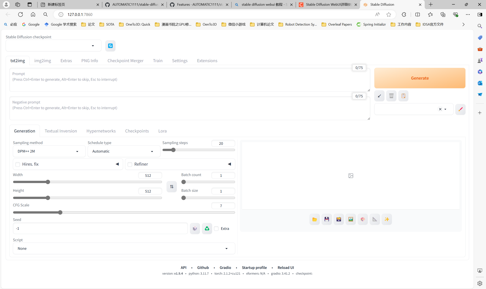
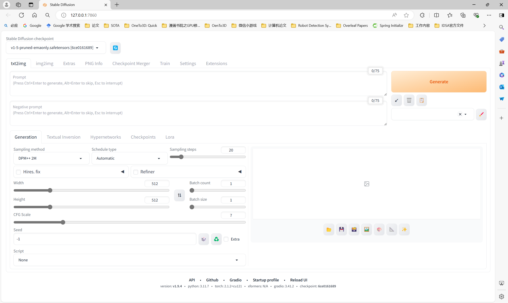
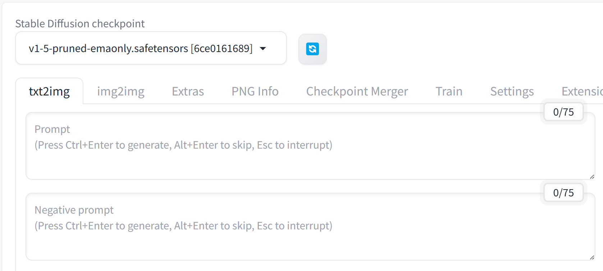

# SD1-下载与运行项目

## 下载

### 网址

[AUTOMATIC1111/stable-diffusion-webui: Stable Diffusion web UI (github.com)](https://github.com/AUTOMATIC1111/stable-diffusion-webui)

## 安装

windows: webui-user.bat

---

## 安装完成后自动运行

### 运行UI




## 再次运行

输入：.\webui-user.bat

输出：

```cmd
PS E:\Stable-Diffusion-WebUI\stable-diffusion-webui> .\webui-user.bat
venv "E:\Stable-Diffusion-WebUI\stable-diffusion-webui\venv\Scripts\Python.exe"
=============================================================================================================================
INCOMPATIBLE PYTHON VERSION

This program is tested with 3.10.6 Python, but you have 3.11.7.
If you encounter an error with "RuntimeError: Couldn't install torch." message,
or any other error regarding unsuccessful package (library) installation,
please downgrade (or upgrade) to the latest version of 3.10 Python
and delete current Python and "venv" folder in WebUI's directory.

You can download 3.10 Python from here: https://www.python.org/downloads/release/python-3106/

Alternatively, use a binary release of WebUI: https://github.com/AUTOMATIC1111/stable-diffusion-webui/releases/tag/v1.0.0-pre

Use --skip-python-version-check to suppress this warning.
=============================================================================================================================
Python 3.11.7 | packaged by Anaconda, Inc. | (main, Dec 15 2023, 18:05:47) [MSC v.1916 64 bit (AMD64)]
Version: v1.9.4
Commit hash: feee37d75f1b168768014e4634dcb156ee649c05
Launching Web UI with arguments: 
no module 'xformers'. Processing without...
no module 'xformers'. Processing without...
No module 'xformers'. Proceeding without it.
Downloading: "https://huggingface.co/runwayml/stable-diffusion-v1-5/resolve/main/v1-5-pruned-emaonly.safetensors" to E:\Stable-Diffusion-WebUI\stable-diffusion-webui\models\Stable-diffusion\v1-5-pruned-emaonly.safetensors

100%|██████████████████████████████████████████████████████████████████████████████████████████████████████████████████████████████████████████| 3.97G/3.97G [21:38<00:00, 3.29MB/s]
Calculating sha256 for E:\Stable-Diffusion-WebUI\stable-diffusion-webui\models\Stable-diffusion\v1-5-pruned-emaonly.safetensors: Running on local URL:  http://127.0.0.1:7860

To create a public link, set `share=True` in `launch()`.
Startup time: 1312.2s (prepare environment: 4.3s, import torch: 3.3s, import gradio: 1.2s, setup paths: 1.7s, initialize shared: 0.8s, other imports: 0.4s, list SD models: 1299.7s, load scripts: 0.4s, create ui: 0.3s, gradio launch: 0.1s).
6ce0161689b3853acaa03779ec93eafe75a02f4ced659bee03f50797806fa2fa
Loading weights [6ce0161689] from E:\Stable-Diffusion-WebUI\stable-diffusion-webui\models\Stable-diffusion\v1-5-pruned-emaonly.safetensors
Creating model from config: E:\Stable-Diffusion-WebUI\stable-diffusion-webui\configs\v1-inference.yaml
E:\Stable-Diffusion-WebUI\stable-diffusion-webui\venv\Lib\site-packages\huggingface_hub\file_download.py:1132: FutureWarning: `resume_download` is deprecated and will be removed in version 1.0.0. Downloads always resume when possible. If you want to force a new download, use `force_download=True`.
  warnings.warn(
vocab.json: 100%|████████████████████████████████████████████████████████████████████████████████████████████████████████████████████████████████| 961k/961k [00:00<00:00, 2.34MB/s]
merges.txt: 100%|████████████████████████████████████████████████████████████████████████████████████████████████████████████████████████████████| 525k/525k [00:00<00:00, 1.78MB/s]
special_tokens_map.json: 100%|█████████████████████████████████████████████████████████████████████████████████████████████████████████████████████████████| 389/389 [00:00<?, ?B/s]
tokenizer_config.json: 100%|███████████████████████████████████████████████████████████████████████████████████████████████████████████████████████████████| 905/905 [00:00<?, ?B/s]
config.json: 100%|█████████████████████████████████████████████████████████████████████████████████████████████████████████████████████████████████████| 4.52k/4.52k [00:00<?, ?B/s]
Applying attention optimization: Doggettx... done.
Model loaded in 10.0s (calculate hash: 3.6s, create model: 4.2s, apply weights to model: 2.0s, calculate empty prompt: 0.1s).
Interrupted with signal 2 in <frame at 0x00000177A0298200, file 'D:\\Anaconda\\Lib\\threading.py', line 331, code wait>
```

## 运行成功后显示



可见自动在线的模型已经自动装载：


