# SD4-文生图-正反指令

## 通过命令：.\webui-user.bat 运行

## .\web-user.bat 启动

## 累加命令测试

### Tree

#### Code: tree

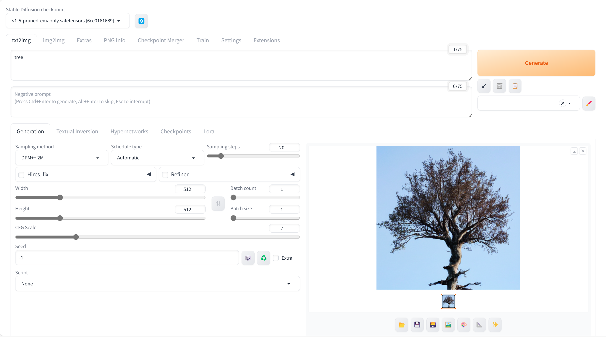

#### Code: a green tree

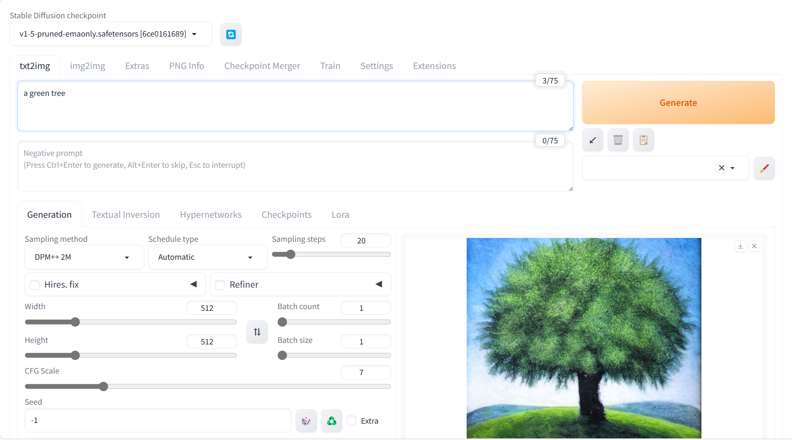

#### Code: a green tree without leaves

#### Code: a green tree without leaves and trunk

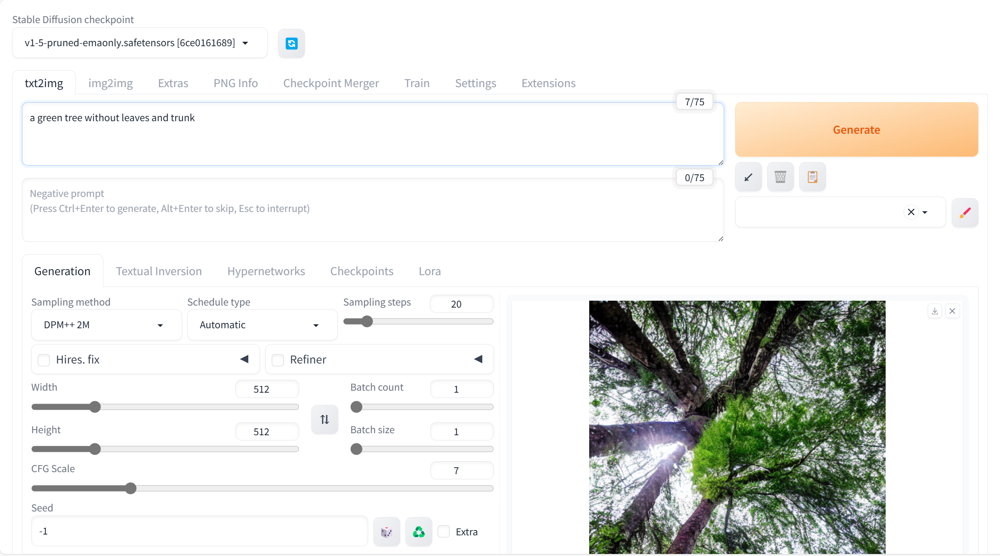

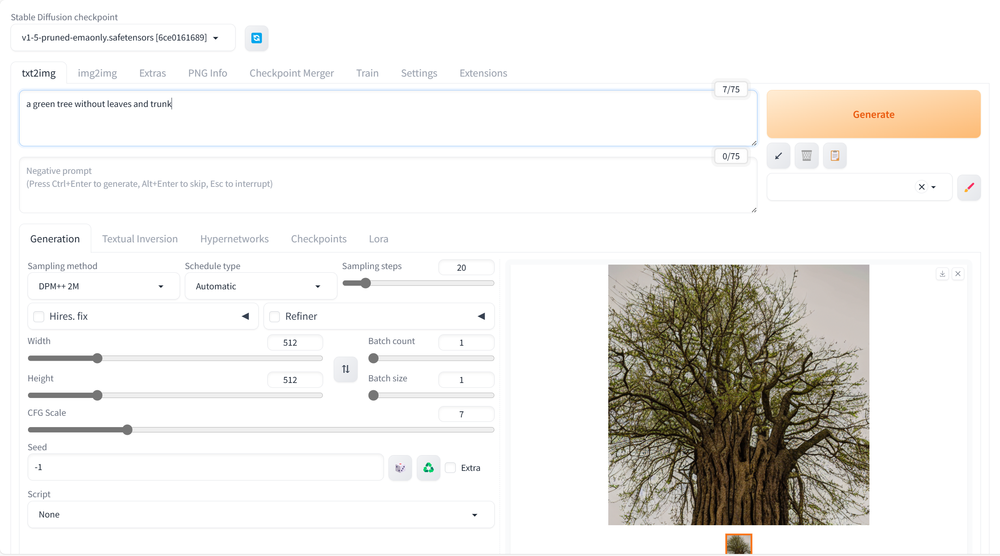

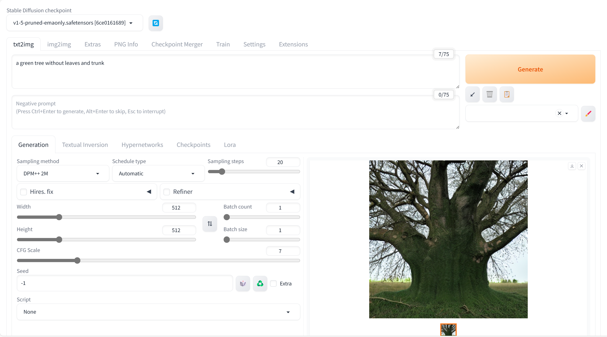

由此可见，SD模型对于一些训练数据集中不常见的，或者没有理解的物体是很难自主设计出来的。

Code: a green tree without leaves located in the sea

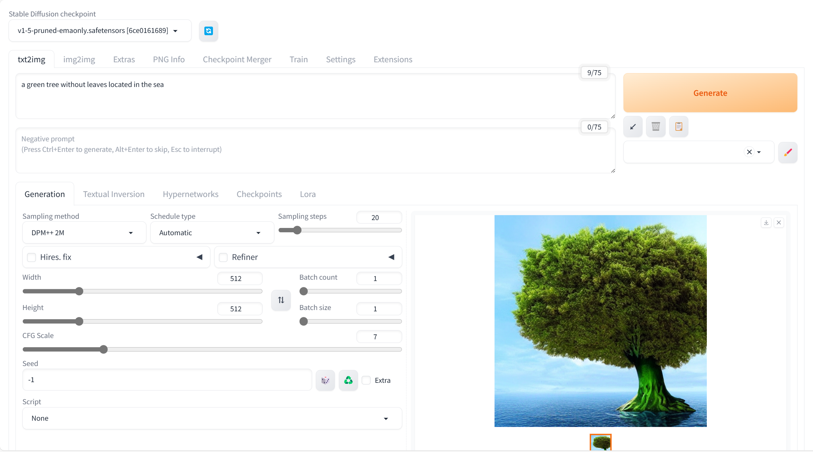

但是，SD模型对于一些训练数据集中少见的，或者奇特的但是能够理解的物体是可以自主设计出来的。

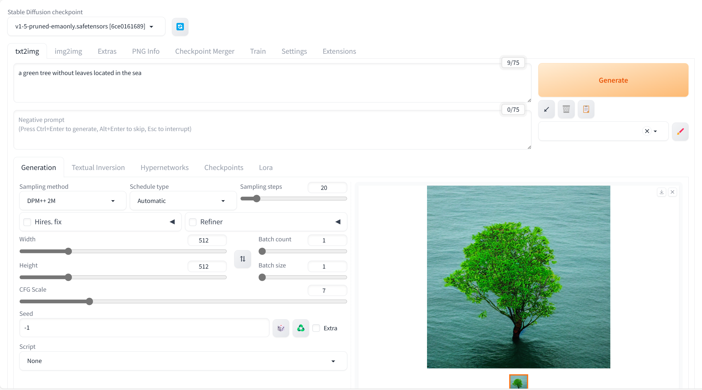

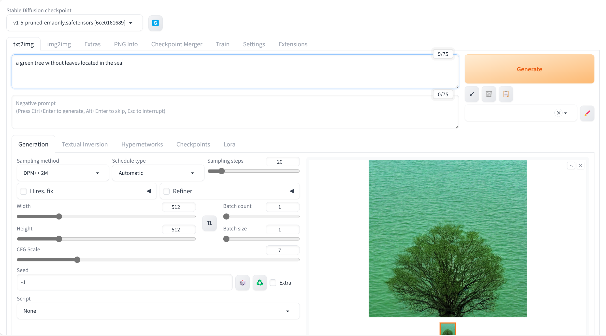

## 增加生成目标对象的数量

### Code: two green trees without leaves located in the sea

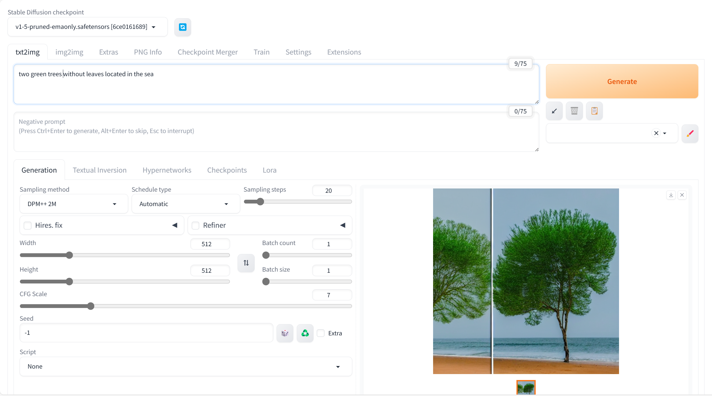

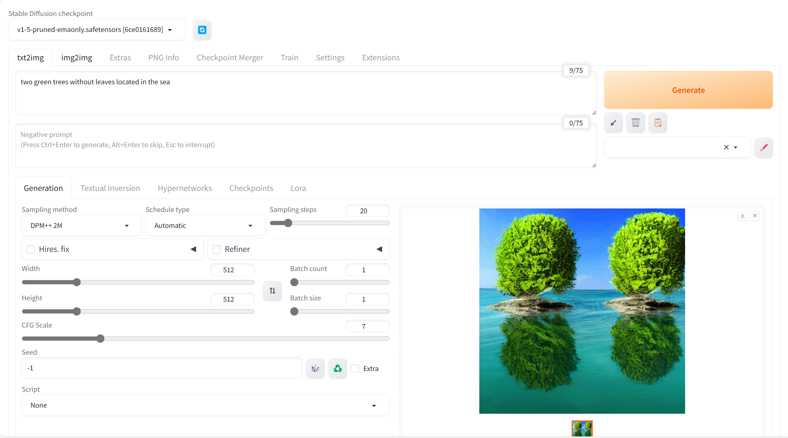

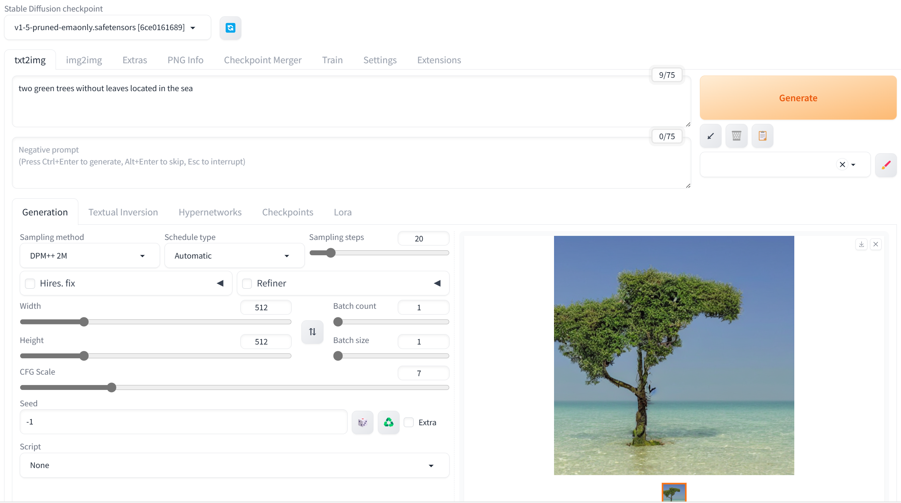

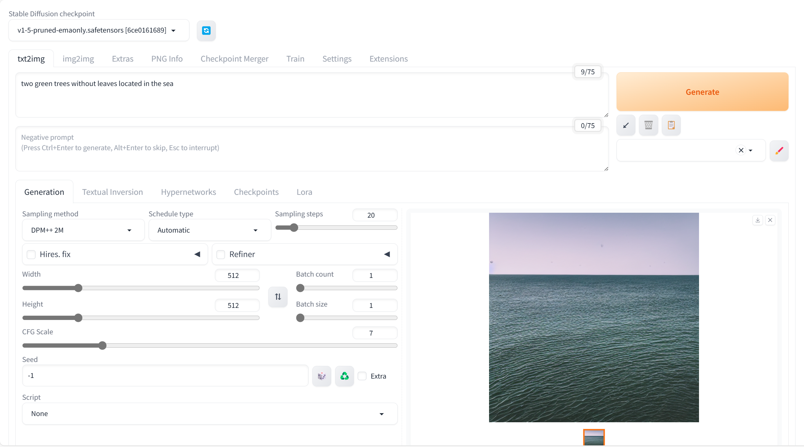

可见，V1.5版本的模型对数量的理解能力不大。

---

## 添加反向命令：Negative Prompts

### 输入命令：

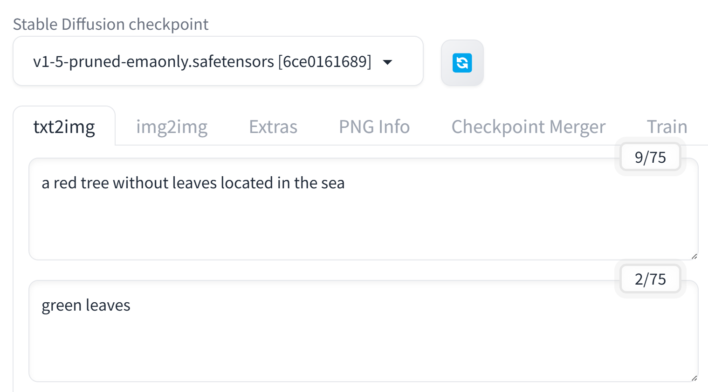

#### 正命令：a red tree without leaves located in the sea

#### 反命令：green leaves

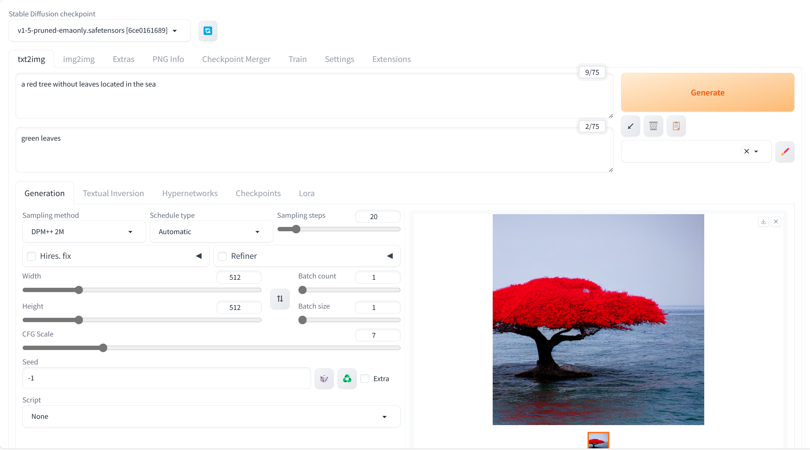

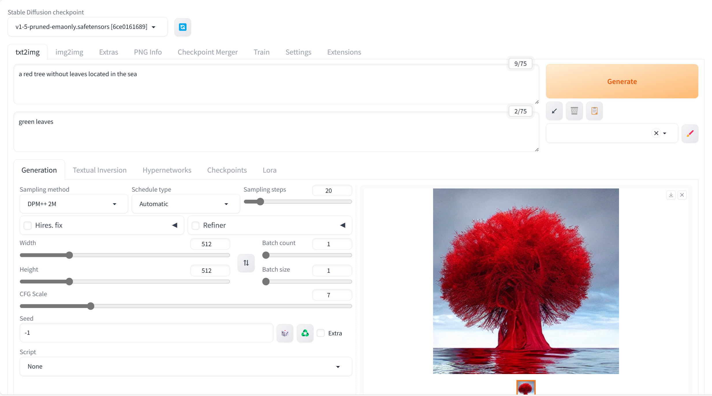

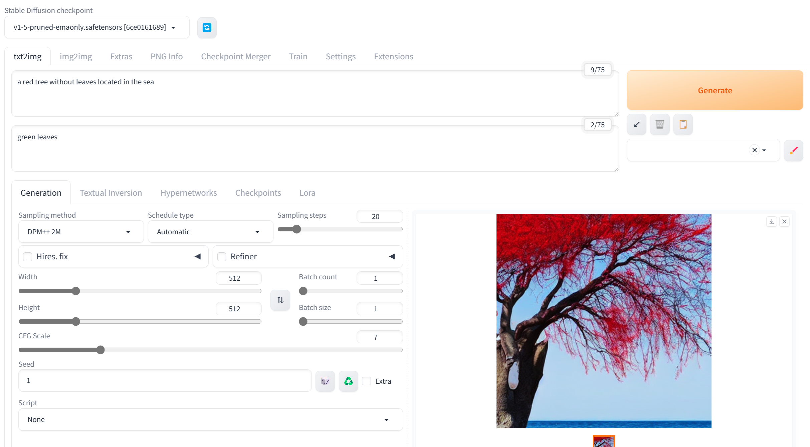

通过多次尝试，V1.5版模型能够生成一定数量的，符合正反指令要求的图片。
