# SD7-文生图-采样步数

## 通过命令：.\webui-user.bat 运行

## .\web-user.bat 启动

## Code: one green tree

## Sampling Steps

### 1

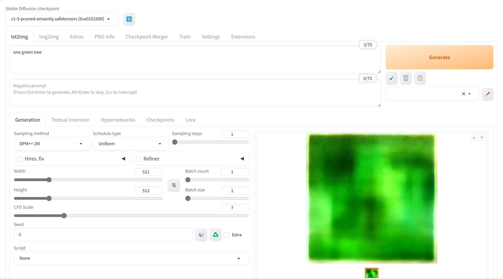

### 2

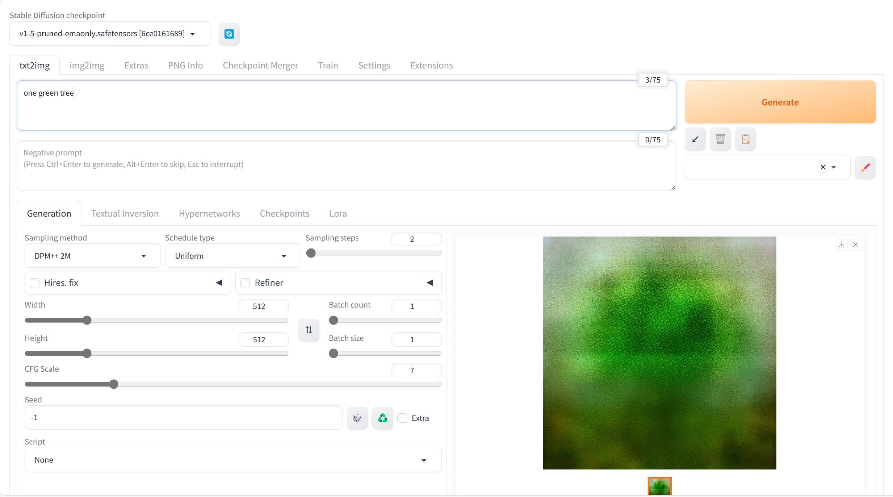

### 3

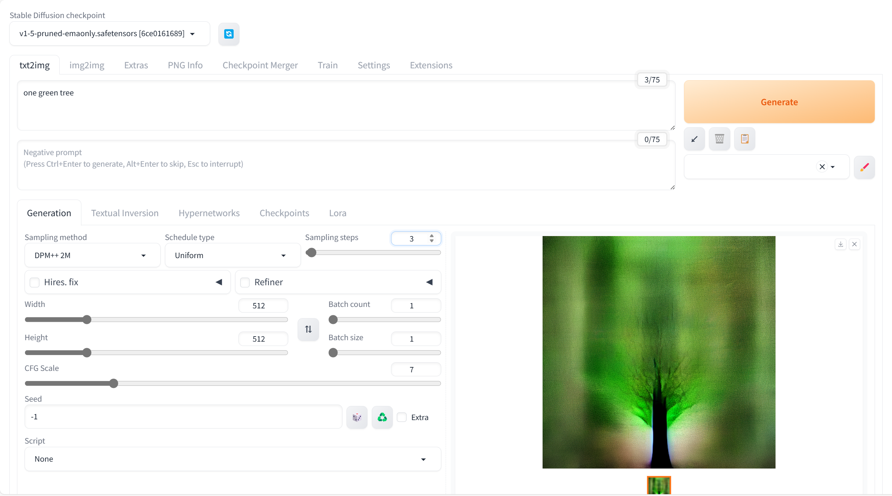

### 4

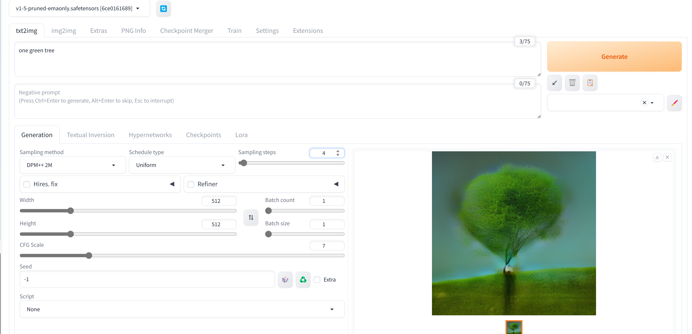

### 5

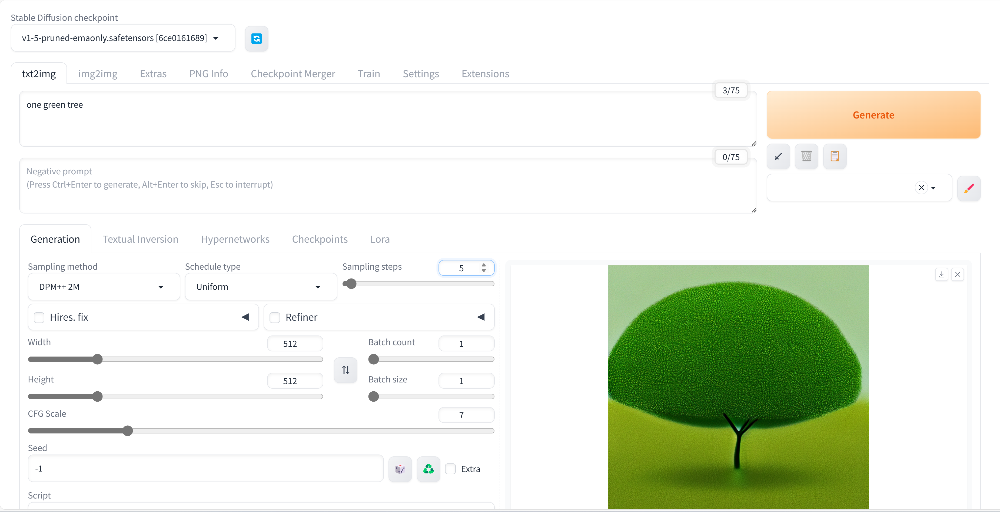

### 6

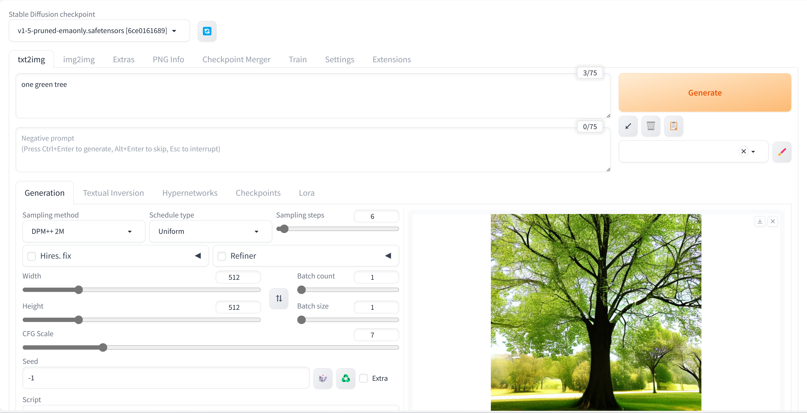

### 7

### 8

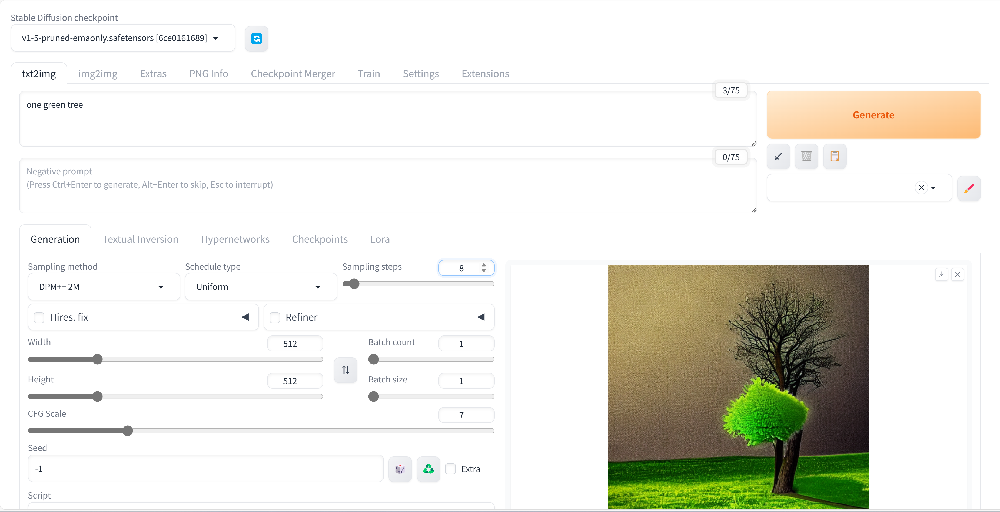

### 9

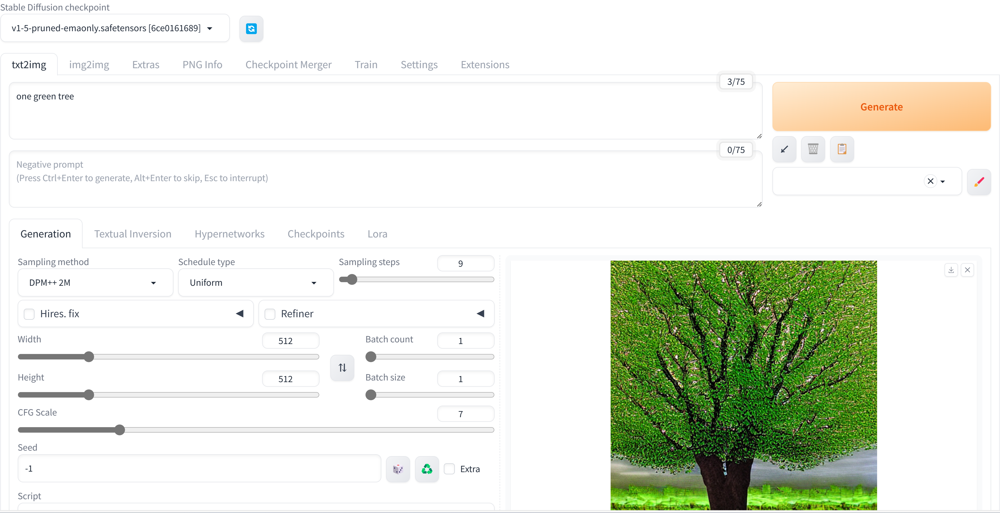

### 10

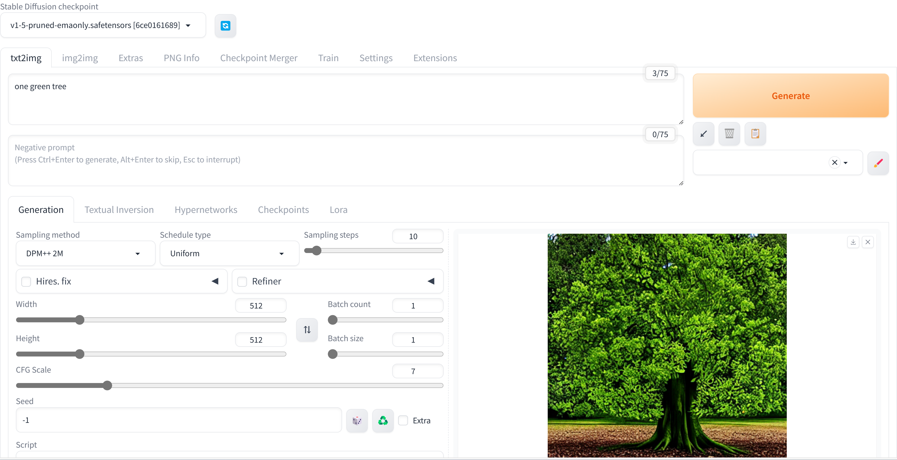

### 15

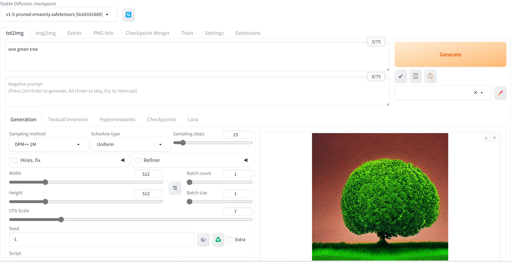

### 20

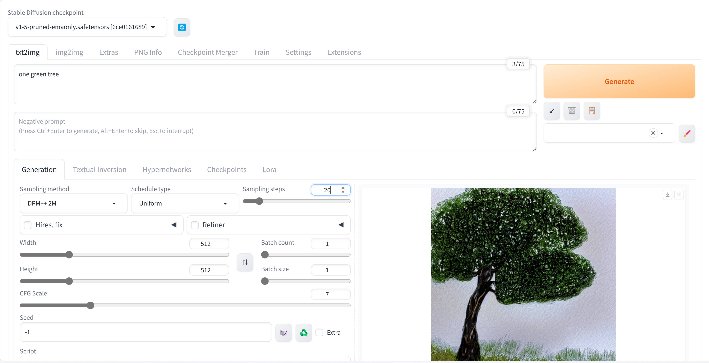

### 40

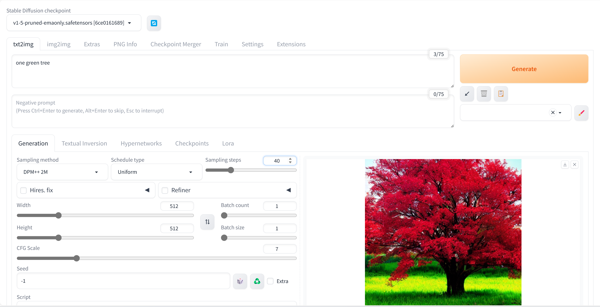

采样次数过大可能会出现错误。

### 80

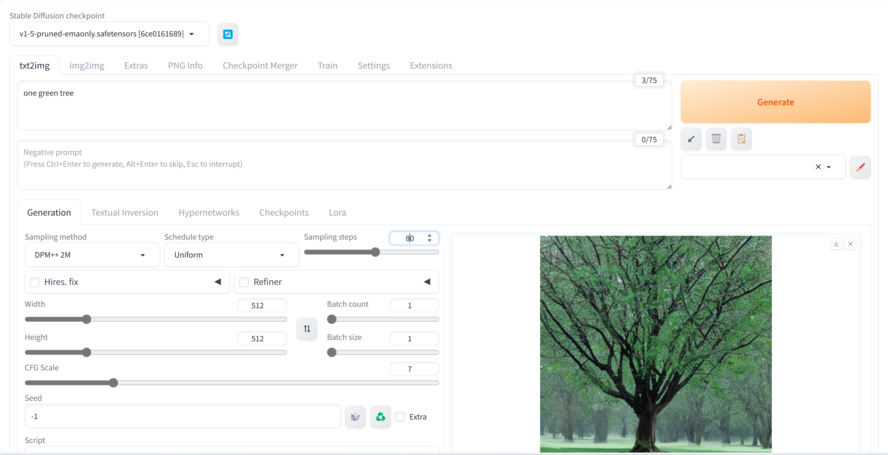

### 150

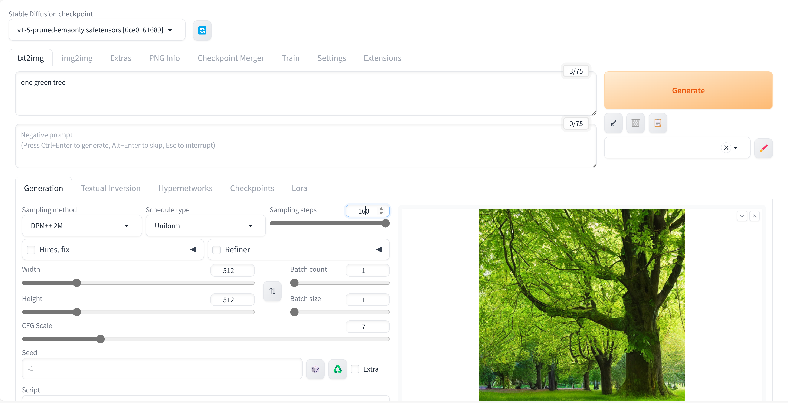

最大的可设置步数为150。

1
