# SD10-文生图-CFG Scale设置

## 通过命令：.\webui-user.bat 运行

## .\web-user.bat 启动

## Code: one green tree

## CFG Scale = 7.5 = default

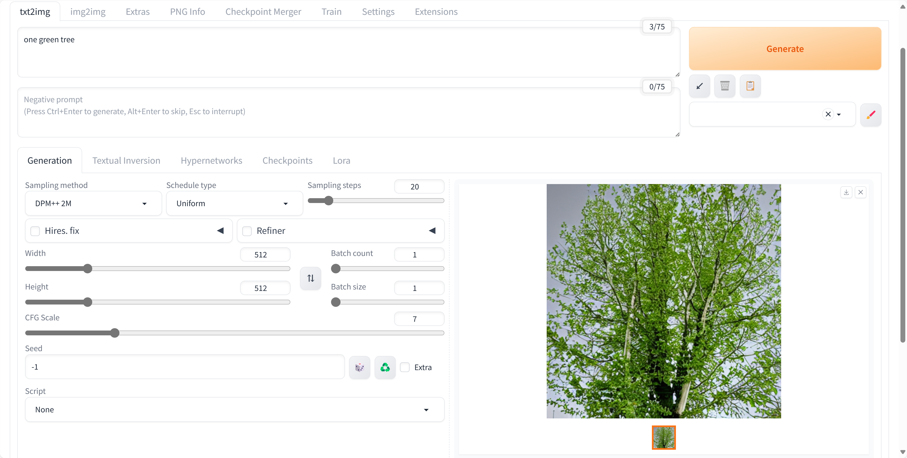

## CFG Scale = 1

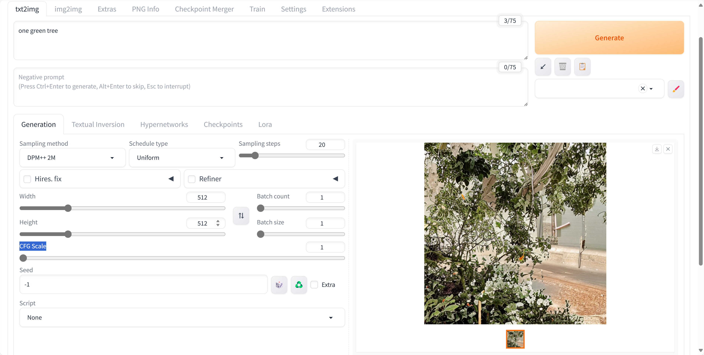

## CFG Scale = 2

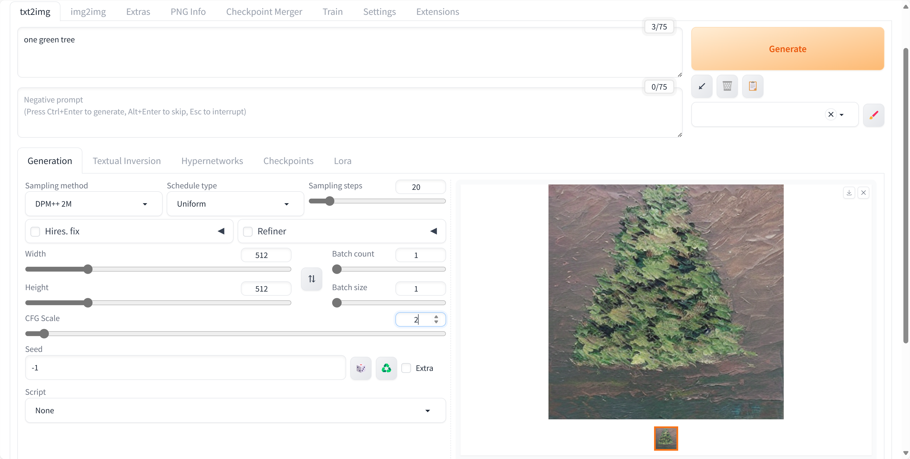

### CFG Scale = 3

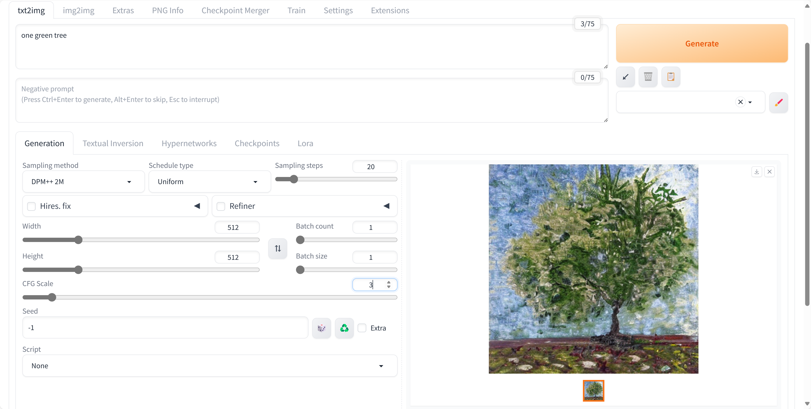

## CFG Scale = 4

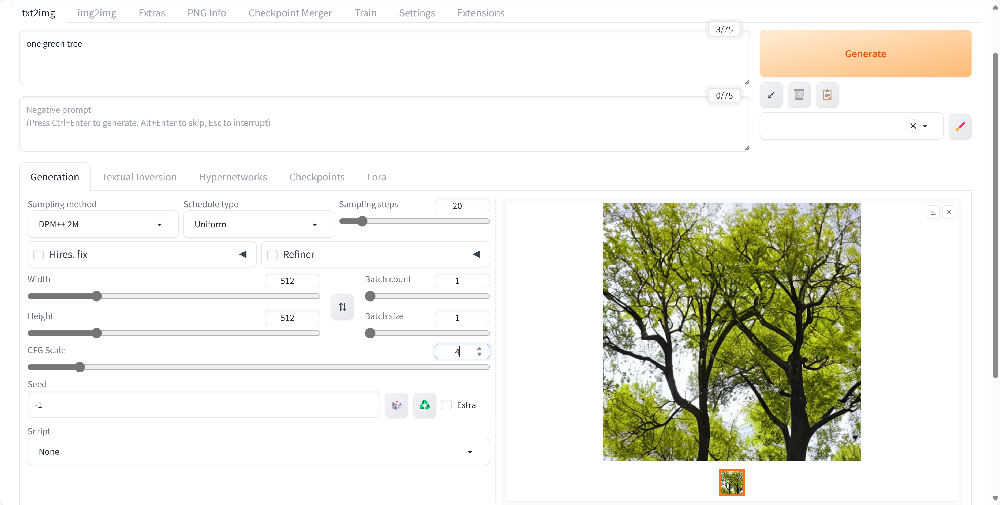

## CFG Scale = 5

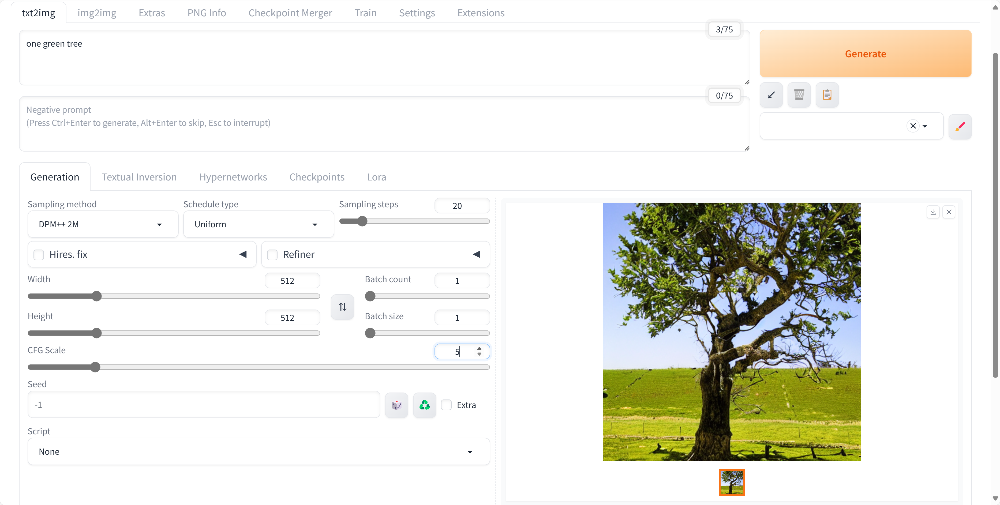

## CFG Scale = 6

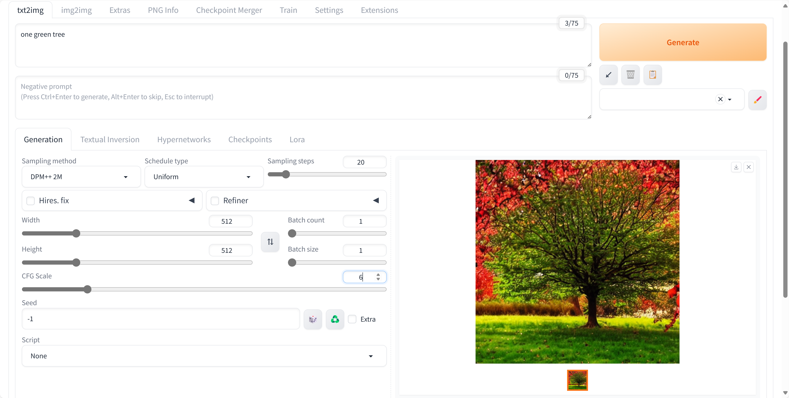

## CFG Scale = 7

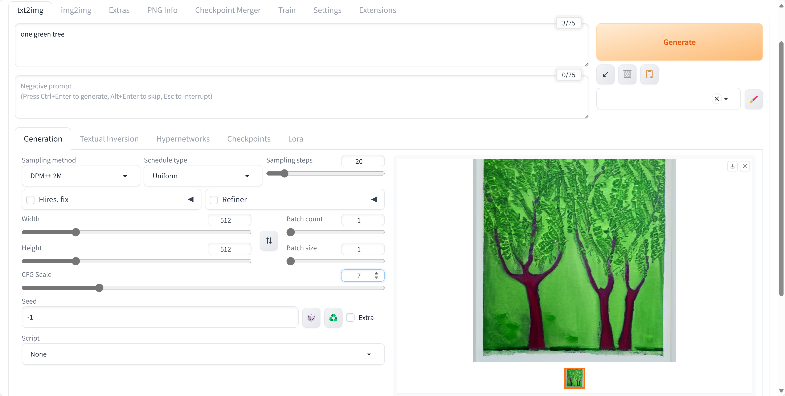

## CFG Scale = 8

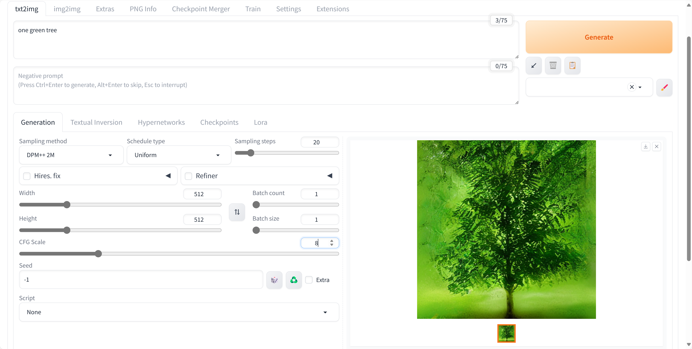

## CFG Scale = 9

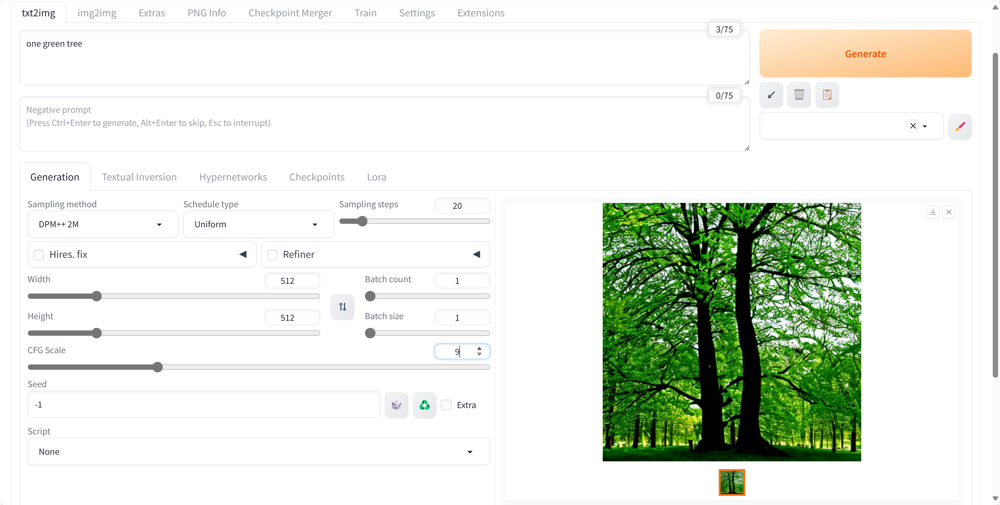

## CFG Scale = 10

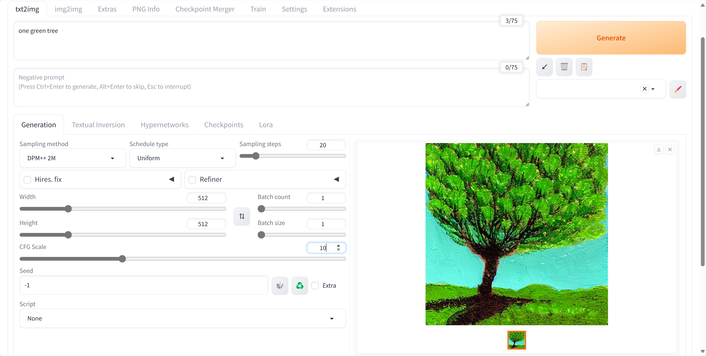

## CFG Scale = 15

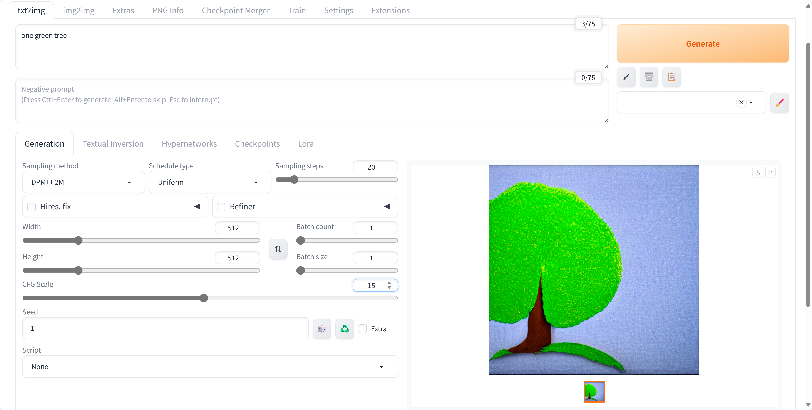

## CFG Scale = 20

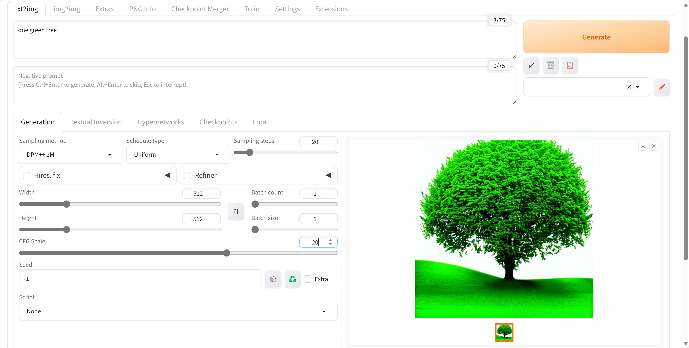

## CFG Scale = 25

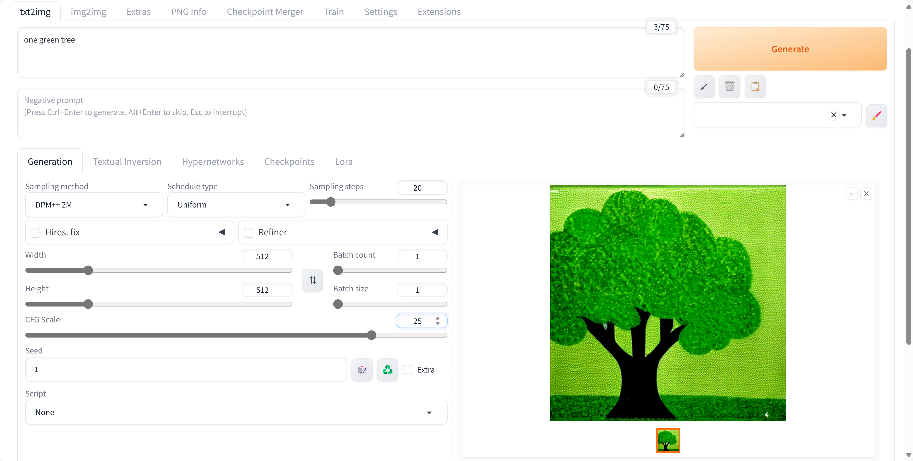

## CFG Scale = 30 = MAX

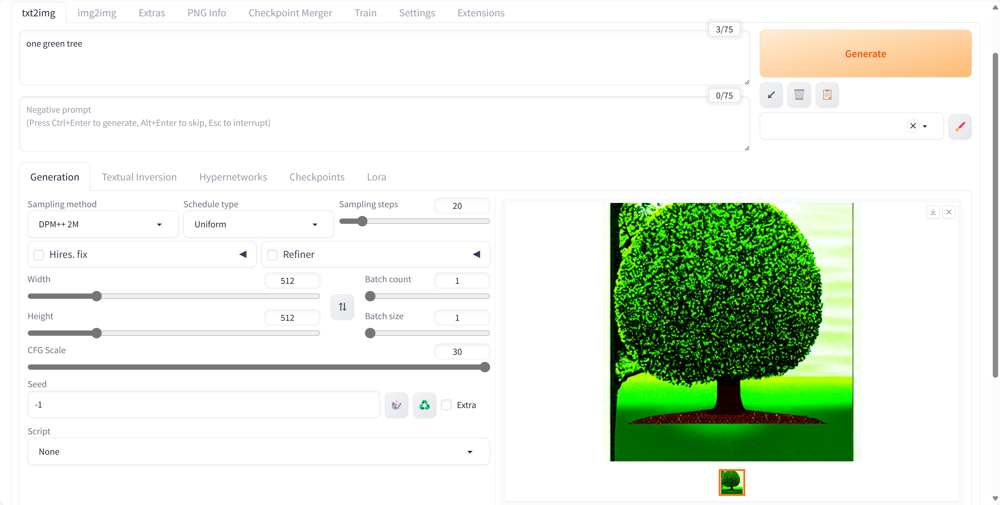

1
