# SD5-文生图-采样方法

## 通过命令：.\webui-user.bat 运行

## .\web-user.bat 启动

## Code: green trees

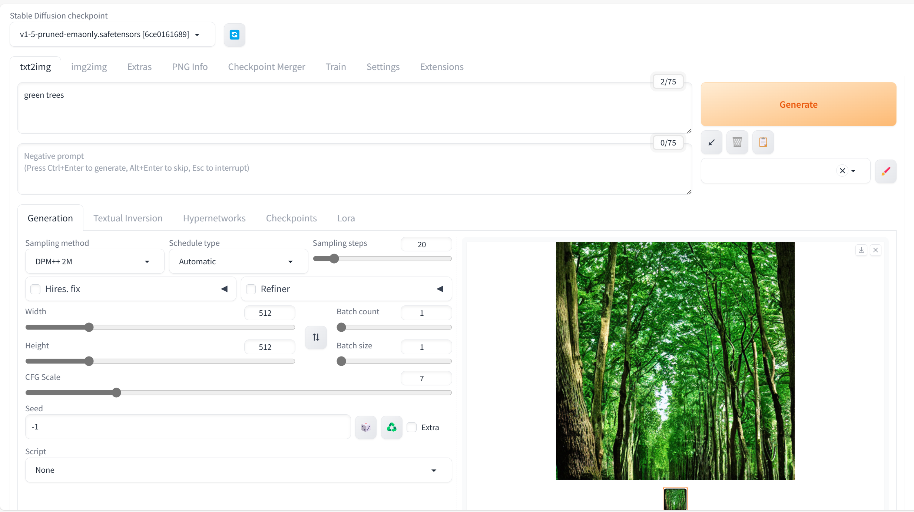

## Code: one green tree

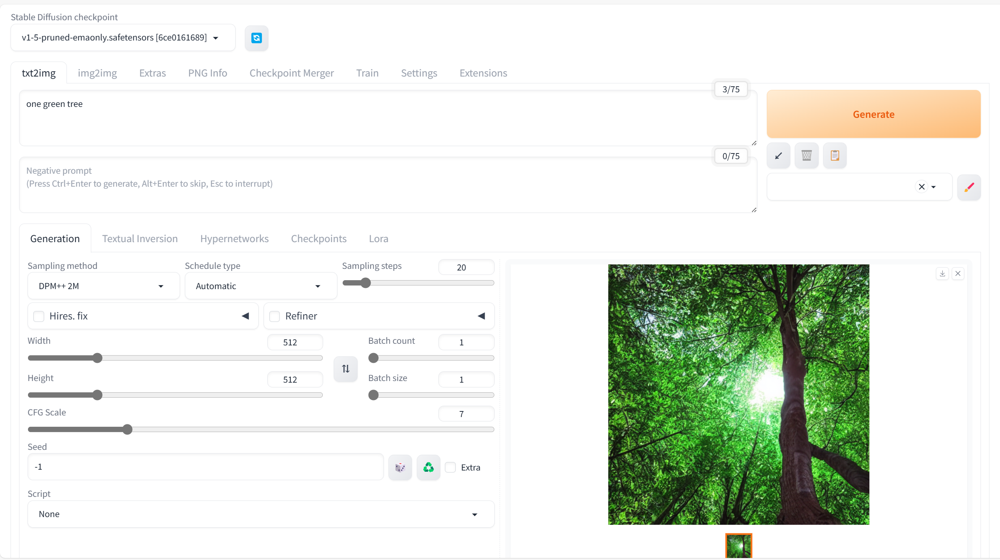

## Sampling Method:

### DPM++ SDE

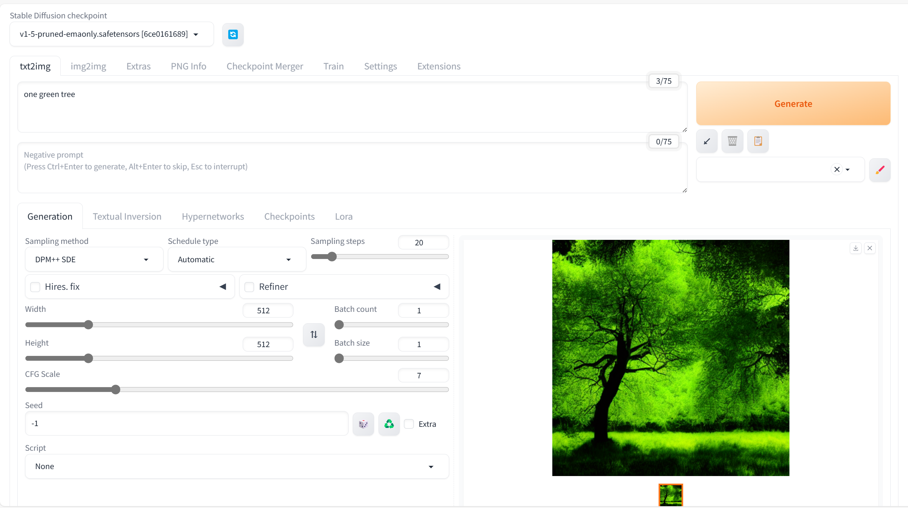

### DPM++ 2M SDE

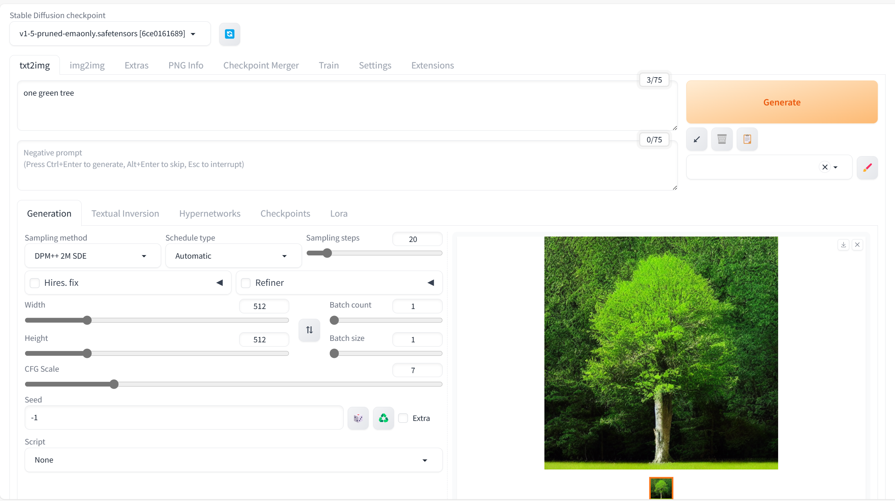

### DPM++ 2M SDE Heun

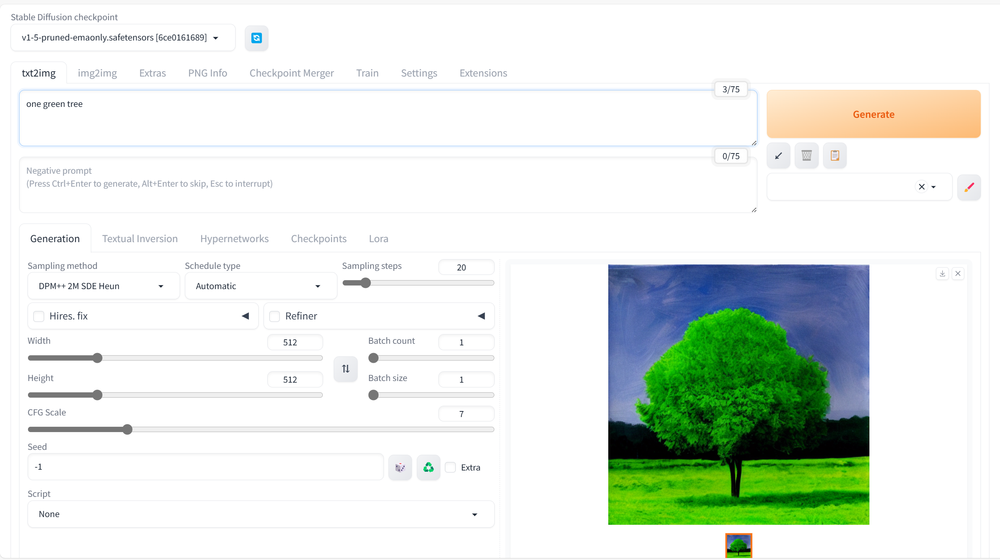

### DPM++ 2S a

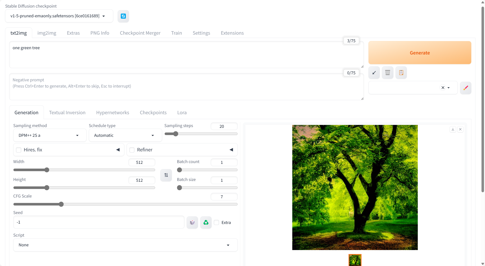

### DPM++ 3M SDE

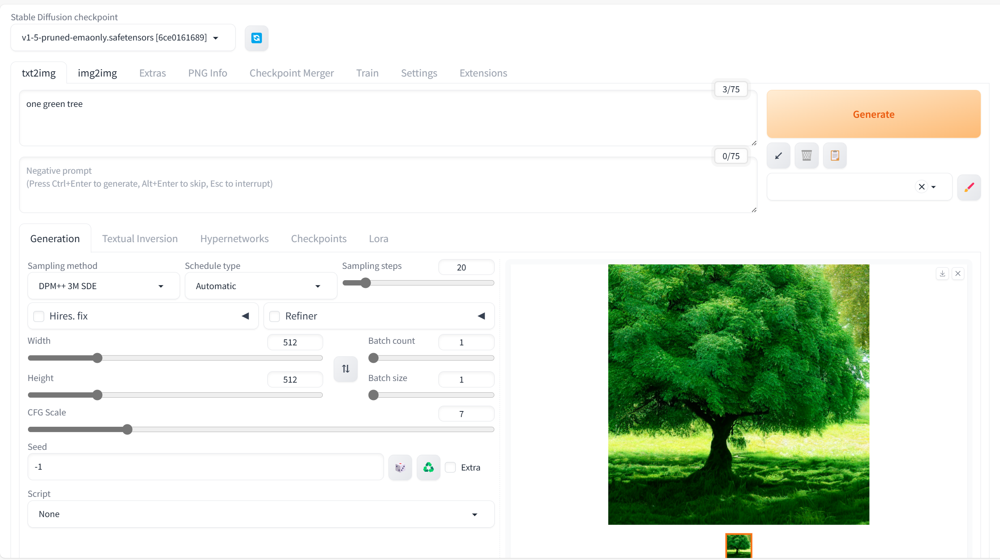

### Euler a

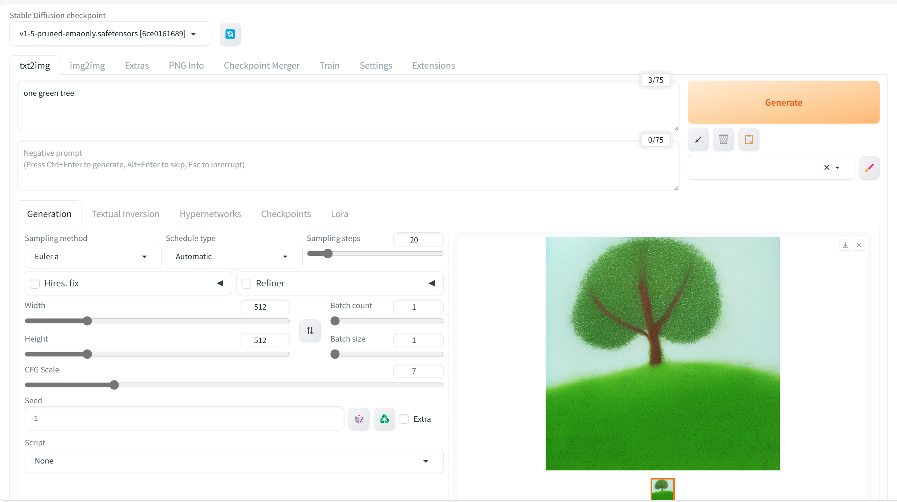

### Euler

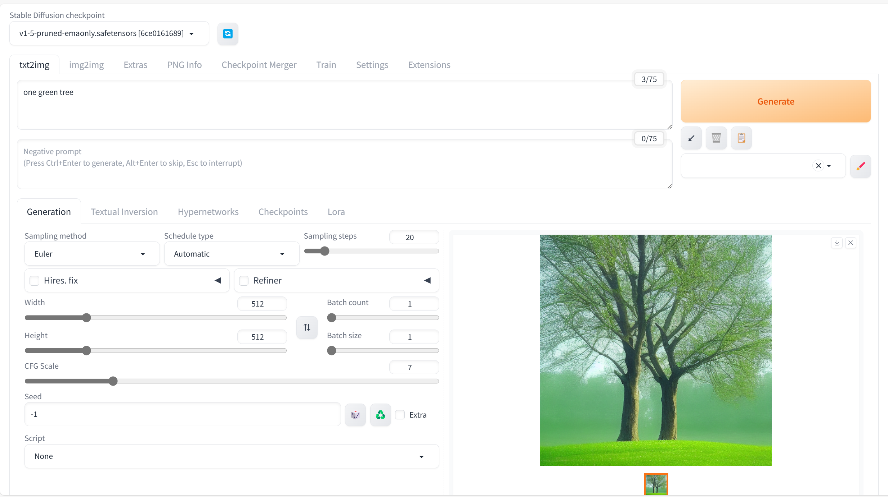

### LMS

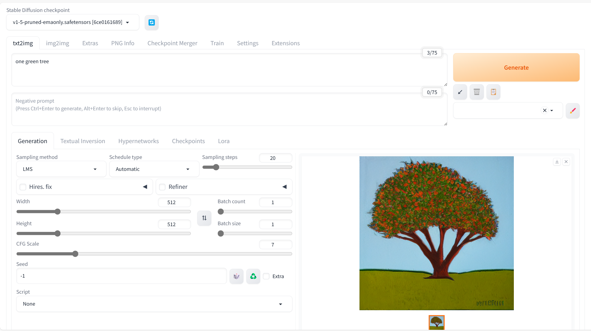

### Heun

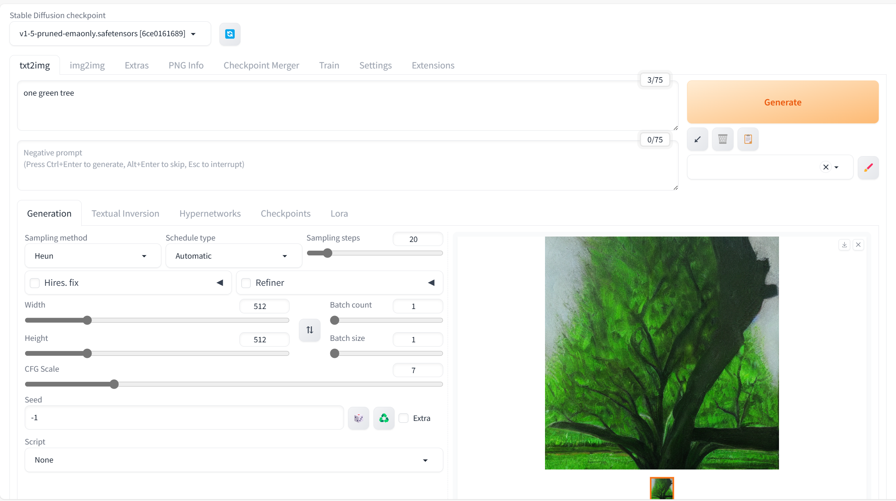

### DPM2

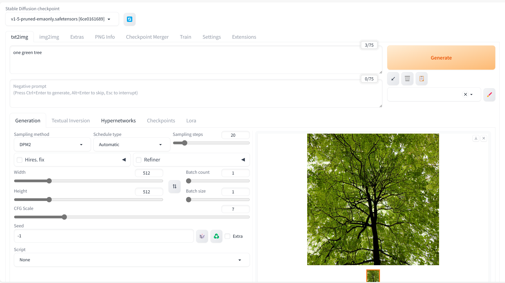

### DPM 2a

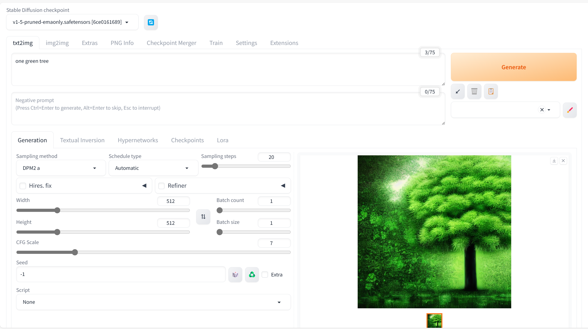

### DPM fast

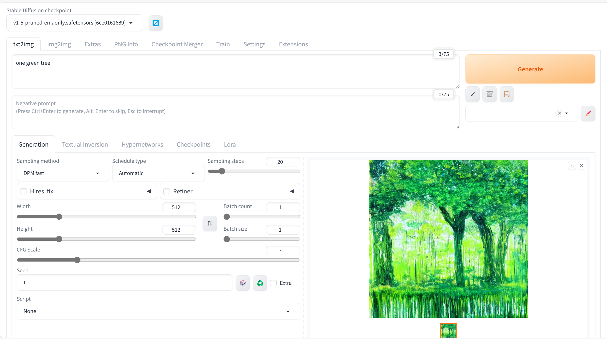

### DPM adaptive

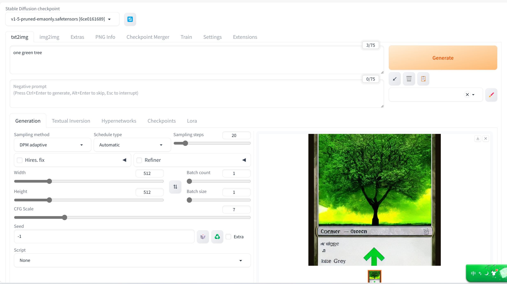

### Restart

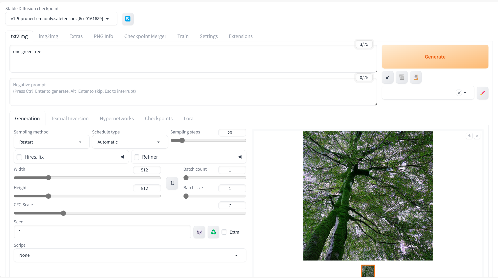

### DDIM

### PLMS

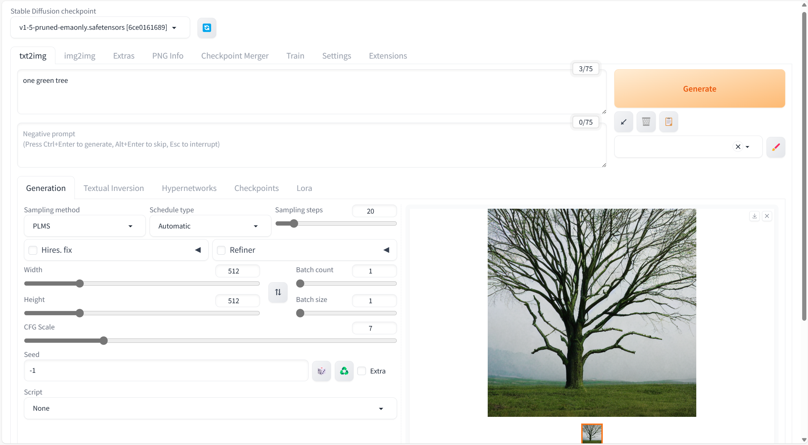

### UniPic

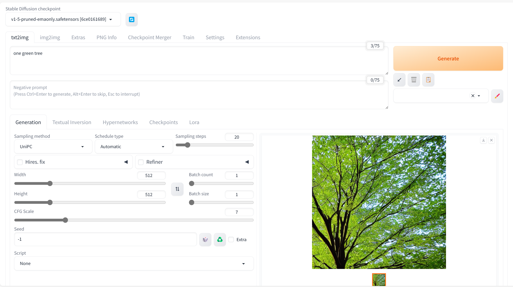

### LCM

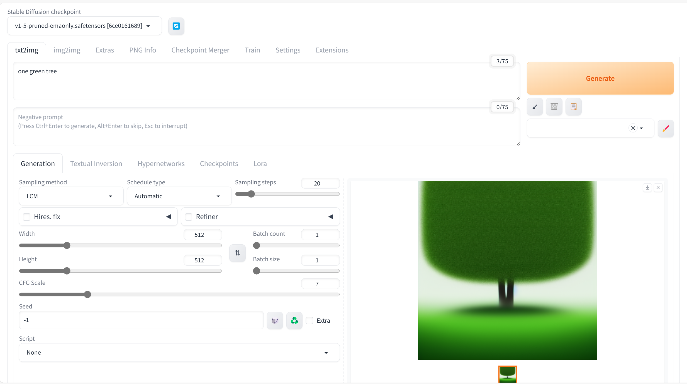

1

1

1
