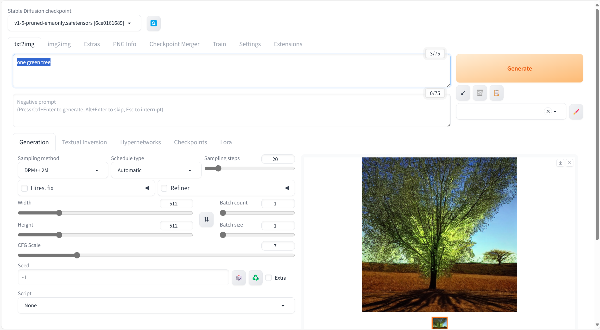
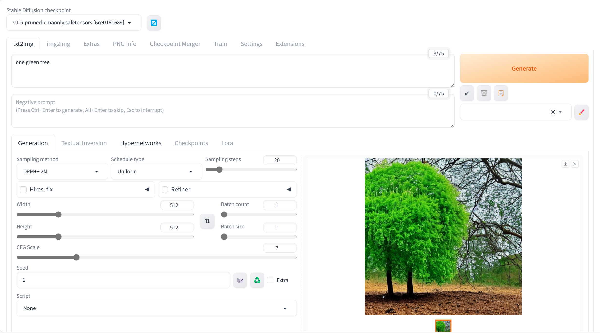
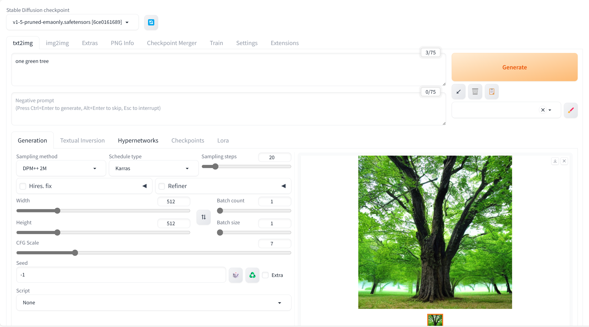
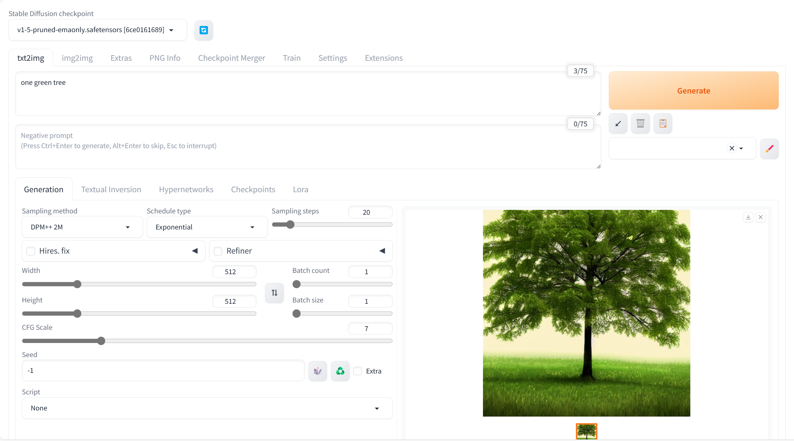
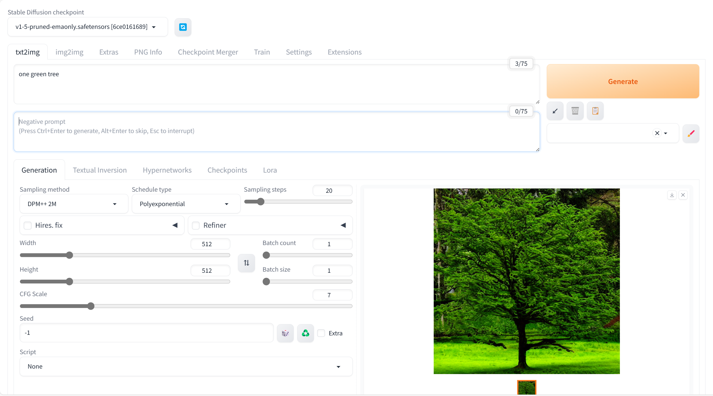
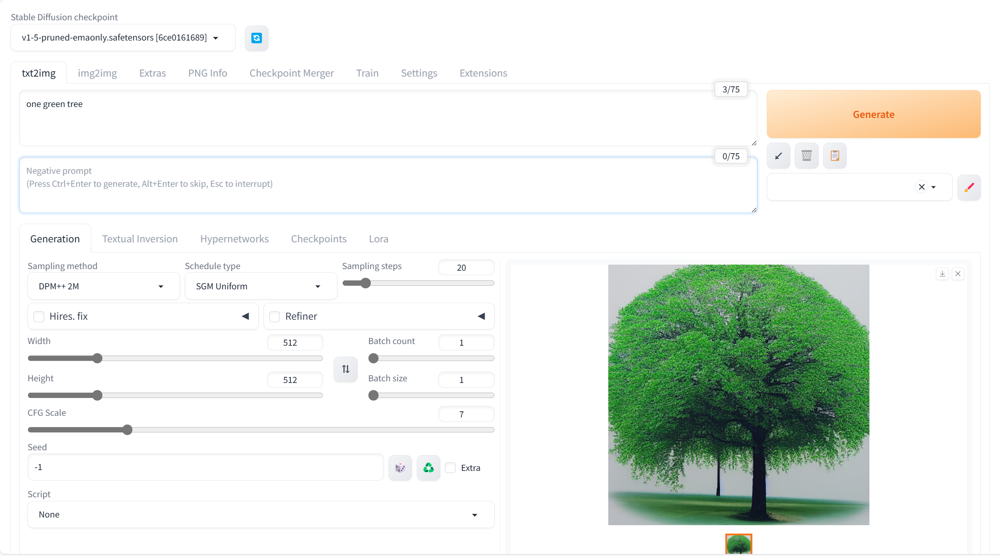

# SD6-文生图-规划类型

## 通过命令：.\webui-user.bat 运行

## .\web-user.bat 启动

## Code: one green tree

## Schedule Type

### Automatic

### Uniform

### Karras

### Exponential

### Polyexponential

### SGM Uniform

1
