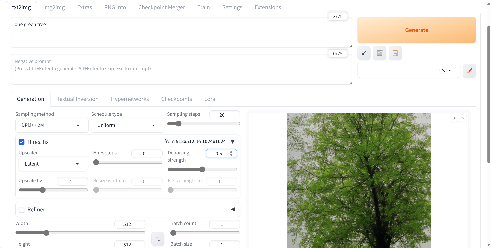
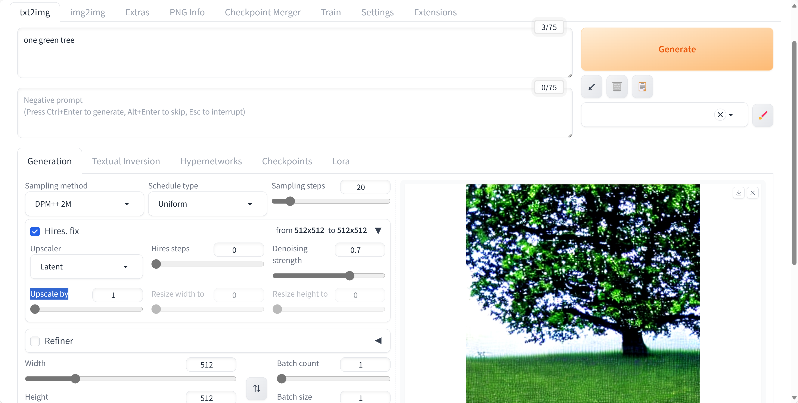
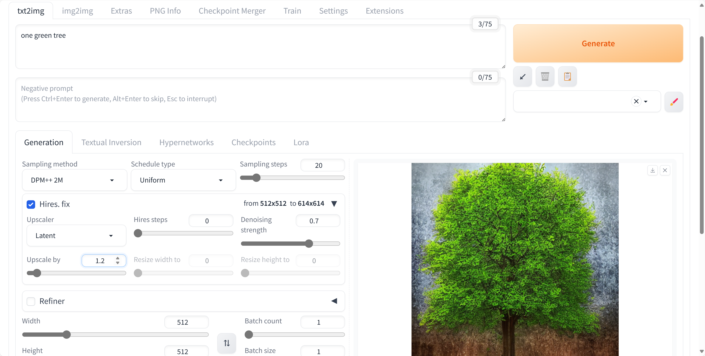
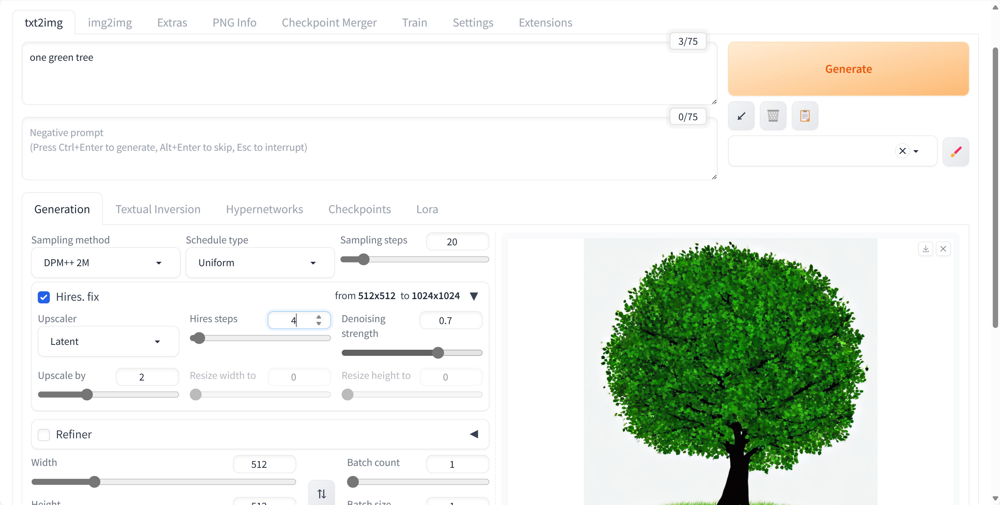
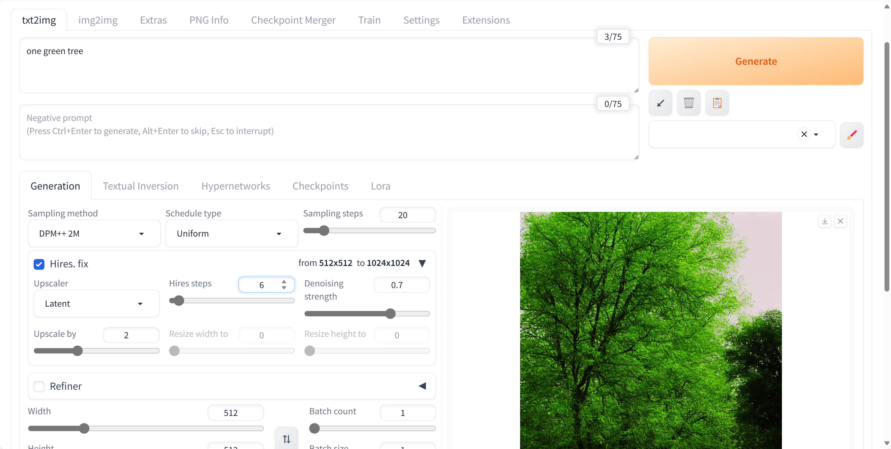
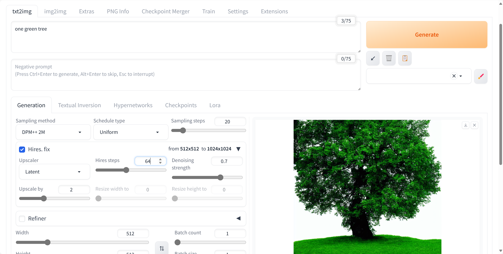

# SD8-文生图-图片修复

## 通过命令：.\webui-user.bat 运行

## .\web-user.bat 启动

## Code: one green tree

## 点击勾选：Hires. fix

## 输出

使用Hires.fix输出的图片的分别率更高，但是生成时间需要更长。

## 调整：Denoising strength=0.8

## 调整：Denoising strength=0.9

## 调整：Denoising strength=1.0

## 调整：Denoising strength=0.5

## 调整：Denoising strength=0.25

## 调整：Denoising strength=0.1

---

## 恢复 Denoising strength=默认=0.7

## Upscale by = 1

## Upscale by = 1.1

## Upscale by = 1.2

## Upscale by = 1.3

## Upscale by = 1.4

## Upscale by = 1.5

## Upscale by = 1.6

## Upscale by = 1.7

## Upscale by = 1.8

## Upscale by = 1.9

## Upscale by = 2.0

## Upscale by = 2.5

## Upscale by = 3.0

设置 Upscale by = 3.0 后，生成时间明显变长。

## Upscale by = 4.0 最大值

生成时间最长。

---

## 恢复 Upscale by = 2.0

## Hires steps = 1

## Hires steps = 2

## Hires steps = 3

## Hires steps = 4

## Hires steps = 5

## Hires steps = 6

## Hires steps = 7

## Hires steps = 8

# Hires steps = 16

随着该参数逐渐增大，生成时间逐渐延长。

## Hires steps = 32

## Hires steps = 64

1
