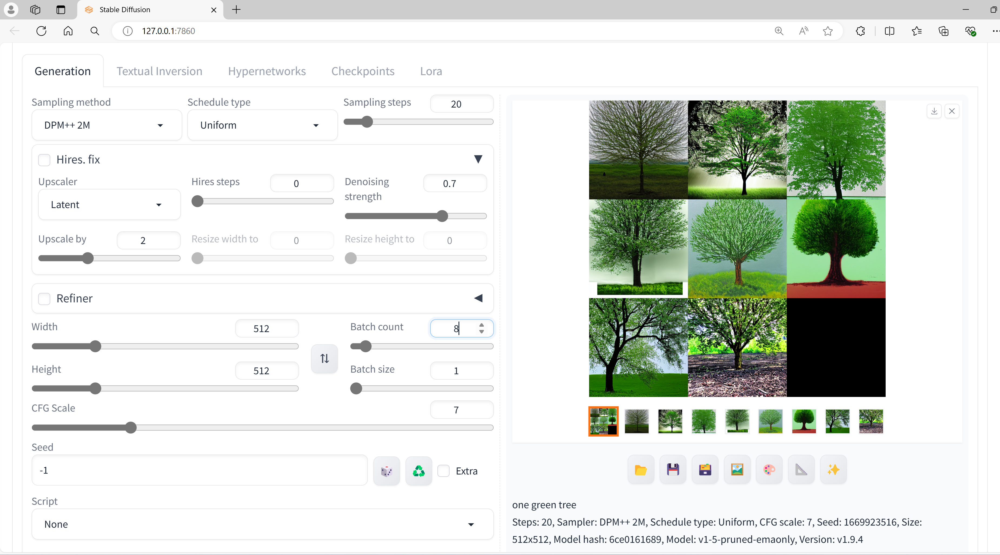
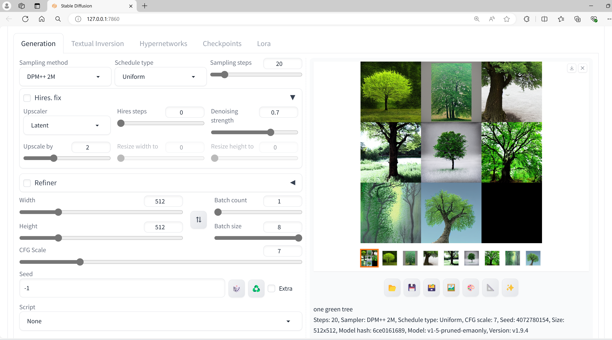

# SD9-文生图-训练批次与尺寸

## 通过命令：.\webui-user.bat 运行

## .\web-user.bat 启动

## Code: one green tree

## Batch count = 2, Batch size = 1

设置两个批次，就会训练出两张图片。

训练时间明显加长。

## Batch count = 3, Batch size = 1

## Batch count = 4, Batch size = 1

## Batch count = 6, Batch size = 1

## Batch count = 8, Batch size = 1

## Batch count = 9, Batch size = 1

## Batch count = 20, Batch size = 1

随着Batch count的增大，单张图片的生成速度有所提高，整体速度变化不明显。

---

## Batch count = 1, Batch size = 2

## Batch count = 1, Batch size = 4

## Batch count = 1, Batch size = 8 = MAX

Batch size对生成时间影响不大。

---
