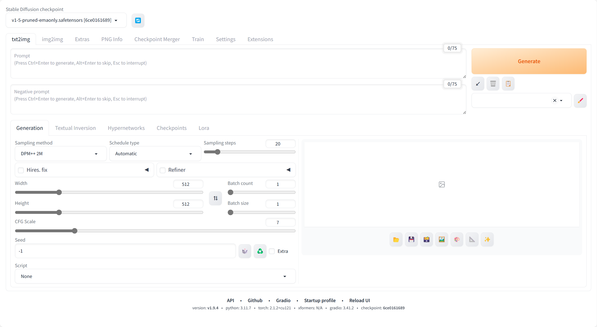
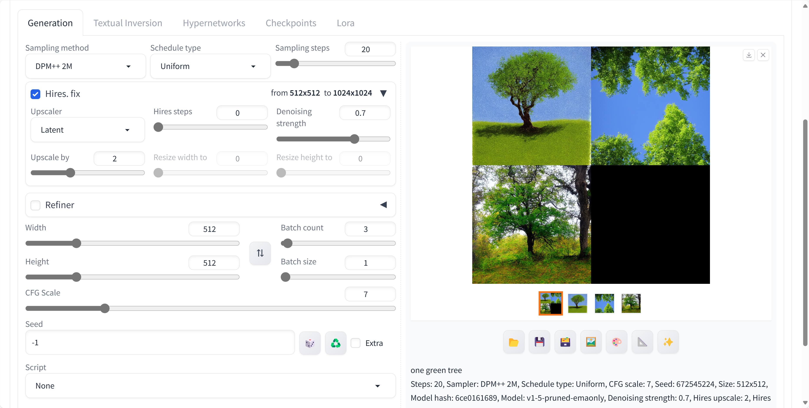

# SD9-文生图-训练批次与尺寸

## 通过命令：.\webui-user.bat 运行

## .\web-user.bat 启动

## Code: one green tree

## Batch count = 2, Batch size = 1

设置两个批次，就会训练出两张图片。

训练时间明显加长。

## Batch count = 3, Batch size = 1

## Batch count = 4, Batch size = 1

1
